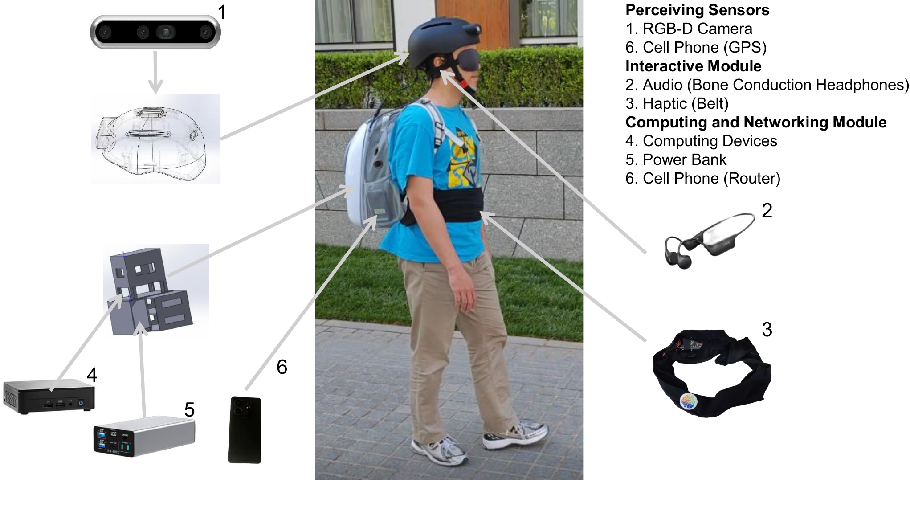
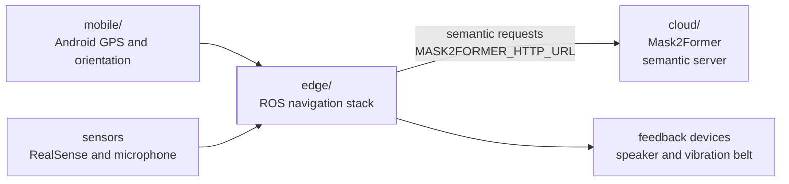

<div align="center">

# eLabrador

### A Wearable Navigation System for Visually Impaired Individuals

English | [简体中文](./README.zh-CN.md)

</div>

eLabrador is a wearable navigation research system for visually impaired individuals. It integrates edge-side ROS perception and planning, cloud-side semantic perception, Android helper apps, and wearable hardware such as a helmet sensor platform and a vibration belt.

## Hardware Configuration

<p align="center">
  
</p>

## System Relationship

Prepare the cloud semantic service and mobile helper apps before launching the full edge stack. The edge stack is the main runtime; it consumes phone GPS/orientation data from `mobile/`, reads wearable sensor input, sends semantic inference requests to `cloud/`, and drives wearable feedback hardware.



## What Is Included

| Area | Path | Contents |
| --- | --- | --- |
| Edge system | [`edge/`](edge/) | ROS 1 catkin workspace, launch files, navigation, speech, VIO, phone GPS, belt, OCR, visualization |
| Cloud service | [`cloud/`](cloud/) | Cloud semantic services, model service code, Docker deployment assets |
| Mobile apps | [`mobile/`](mobile/) | Android helper apps for phone GPS and magnetometer/orientation data forwarding |
| Documentation | [`docs/`](docs/) | System overview, edge getting started, configuration, reproducibility, license notes |

The edge-side ROS workspace is [`edge/`](edge/). Core ROS packages are under [`edge/src/NVI/`](edge/src/NVI/), and whole-system launch files are under [`edge/src/NVI/nvi_bringup/launch/`](edge/src/NVI/nvi_bringup/launch/).

## Cloud-side Mask2Former Optimization

The optimized service uses a fixed 1024×768 input, disables TTA, and supports request-level batching and independent NPZ compression.

| Platform and configuration | B1 P50/P95 | Throughput |
| --- | ---: | ---: |
| H100: CUDA Graph, operator fusion, selective BF16 | 22.162/22.384 ms | 43.988 req/s |
| BW1000: B1 HIP Graph, global BF16, 64-thread MS-Deform | 113.73/114.57 ms | 8.72 req/s |

The H100 and BW1000 measurements used 160/80 warmup iterations followed by 100 measured iterations. They came from different environments and are not a hardware comparison. Labelled-set mIoU remains pending, so these performance configurations remain opt-in.

For installation, configuration, and startup, see the [Cloud Semantic Server guide](docs/cloud-semantic-server.md).

## Quick Start

Start from the edge software. Follow [Edge Getting Started](docs/edge-getting-started.md) for prerequisites, dependency installation, local configuration, device checks, build, and first launch.

Before launching `nvi.launch`, prepare:

- [Cloud Semantic Server](docs/cloud-semantic-server.md): Mask2Former semantic inference service and model checkpoint
- [Mobile Android Apps](docs/mobile-android.md): phone GPS and orientation forwarding on the same LAN as the edge machine

If the prerequisites and local configuration are already prepared, including cloud semantic server endpoints and mobile app network settings for `nvi.launch`:

```bash
source /opt/ros/noetic/setup.bash
cd edge
catkin_make
cd ..
./run_nvi.sh
```

Set the launch entry point in `./run_nvi.sh`.

Common launch entry points:

| Launch file | Purpose |
| --- | --- |
| `nvi.launch` | Basic whole-system stack, including semantic mapping |
| `blind_dreamer.launch` | Outdoor navigation experiment stack |
| `nvi_sensor.launch` | Sensor stack |
| `nvi_realsense.launch` | RealSense camera |
| `nvi_planning.launch` | Global/local planning |
| `nvi_belt.launch` | Vibration belt test |

## Documentation

Start with the [`docs/README.md`](docs/README.md) documentation index. It groups the user guides, Mask2Former optimization records, and profiling evidence.

- [`docs/system-overview.md`](docs/system-overview.md): system architecture and module map
- [`docs/edge-getting-started.md`](docs/edge-getting-started.md): edge prerequisites, installation, configuration, device checks, build, and first launch
- [`docs/configuration.md`](docs/configuration.md): environment variables, model paths, route templates, and local assets
- [`docs/cloud-semantic-server.md`](docs/cloud-semantic-server.md): cloud semantic service and Docker notes
- [`docs/mobile-android.md`](docs/mobile-android.md): Android APK usage
- [`docs/rtk-gnss-extensions.md`](docs/rtk-gnss-extensions.md): external RTK/GNSS integration references
- [`docs/reproducibility.md`](docs/reproducibility.md): public reproduction boundary
- [`docs/license-notes.md`](docs/license-notes.md): license and third-party notices

## Repository Notes

- Use Ubuntu 20.04 and ROS Noetic for the edge stack.
- RealSense, Bluetooth belt, microphone, speaker, and Android apps require physical-device setup. External GNSS/RTK receivers can be integrated separately when high-precision positioning is needed.
- Private credentials, route files, datasets, rosbags, cloud-side Mask2Former checkpoints, optional Qwen-VL weights, and edge-side local model weights are not distributed in this repository. The RSSM local-planning checkpoint can be downloaded from [Google Drive](https://drive.google.com/file/d/1mid3cVu4RZW96qWVOgOr6-XL6GBNSkLD/view) and should be placed as `best_rssm_trajectory_model.pth` under the directory configured by `NVI_LOCAL_PLANNING_MODEL` (default: `models/`). See [Reproducibility Boundary](docs/reproducibility.md) and [Edge Getting Started](docs/edge-getting-started.md).
- Keep generated folders such as `build/`, `devel/`, `install/`, `log/`, `data/`, `models/`, and `outputs/` out of Git.

## Citation

If this repository helps your research, please cite:

```bibtex
@article{kan2025elabrador,
  author={Kan, Meina and Zhang, Lixuan and Liang, Hao and Zhang, Boyuan and Fang, Minxue and Liu, Dongyang and Shan, Shiguang and Chen, Xilin},
  journal={IEEE Transactions on Automation Science and Engineering},
  title={eLabrador: A Wearable Navigation System for Visually Impaired Individuals},
  year={2025},
  volume={22},
  pages={12228-12244},
  keywords={Navigation;Robots;Legged locomotion;Cameras;Robot vision systems;Semantics;Automation;Global Positioning System;Urban areas;Roads;Wearable navigation system;navigation for visually impaired;outdoor navigation;eLabrador},
  doi={10.1109/TASE.2025.3541055}
}
```

```bibtex
@article{ju2026walking,
  author={Ju, Haokun and Zhang, Lixuan and Cao, Xiangyu and Kan, Meina and Shan, Shiguang and Chen, Xilin},
  journal={IEEE Robotics and Automation Letters},
  title={Walking World Model for Visually Impaired Path Following},
  year={2026},
  volume={11},
  number={2},
  pages={2042-2049},
  keywords={Legged locomotion;Navigation;Load modeling;Data models;Cognitive load;Predictive models;Robots;Training;Safety;Robot sensing systems;Design and human factors;wearable robotics;human-centered robotics},
  doi={10.1109/LRA.2025.3641097}
}
```

```bibtex
@inproceedings{tang2026plan,
  author={Tang, Xiaolong and Kan, Meina and Shan, Shiguang and Chen, Xilin},
  booktitle={International Conference on Learning Representations},
  title={Plan-R1: Safe and Feasible Trajectory Planning as Language Modeling},
  year={2026},
  url={https://arxiv.org/abs/2505.17659}
}
```

## Cloud Optimization Contribution

中国科学院计算技术研究所高性能计算机研究中心系统软件组

[dtk@ncic.ac.cn](mailto:dtk@ncic.ac.cn)

## License

Unless a file or directory states otherwise, project-owned code is released under GPLv3. Third-party components, models, datasets, and binary artifacts remain under their original licenses. See [`LICENSE`](LICENSE) and [`docs/license-notes.md`](docs/license-notes.md).
