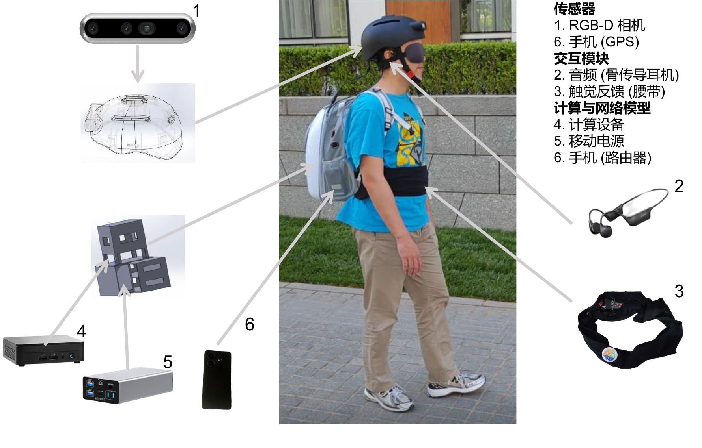
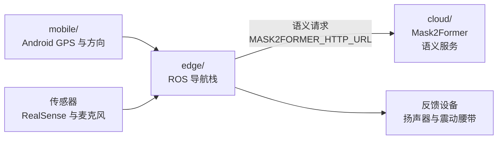

<div align="center">

# eLabrador

### 面向视障人士的穿戴式导航系统

[English](./README.md) | 简体中文

</div>

eLabrador 是一套面向视障人士出行辅助研究的穿戴式导航系统，集成端侧 ROS 感知与规划、云侧语义感知、Android 辅助应用，以及头戴传感器平台和震动腰带等穿戴式硬件。

## 硬件配置

<p align="center">
  
</p>

## 系统关系

运行完整端侧栈前，建议先准备好云侧语义服务和移动端辅助应用。端侧是主要运行栈；它接收 `mobile/` 提供的手机 GPS/方向数据，读取穿戴式传感器输入，向 `cloud/` 请求语义推理，并驱动穿戴式反馈硬件。



## 仓库内容

| 模块 | 路径 | 内容 |
| --- | --- | --- |
| 端侧系统 | [`edge/`](edge/) | ROS 1 catkin 工作空间、启动文件、导航、语音、VIO、手机 GPS、腰带、OCR、可视化 |
| 云侧服务 | [`cloud/`](cloud/) | 云侧语义服务、模型服务代码、Docker 部署文件 |
| 移动端应用 | [`mobile/`](mobile/) | 用于手机 GPS 和磁力计/方向数据转发的 Android 辅助应用 |
| 文档 | [`docs/`](docs/) | 系统总览、端侧入门、配置、复现边界、许可证说明 |

端侧 ROS 工作空间为 [`edge/`](edge/)。核心 ROS package 位于 [`edge/src/NVI/`](edge/src/NVI/)，整机启动文件位于 [`edge/src/NVI/nvi_bringup/launch/`](edge/src/NVI/nvi_bringup/launch/)。

## Mask2Former 云侧推理优化

优化后的服务使用固定 1024×768 输入，关闭 TTA，并支持请求级 batch 和独立 NPZ 压缩。

| 平台与配置 | B1 P50/P95 | 吞吐 |
| --- | ---: | ---: |
| H100：CUDA Graph、算子融合、选择性 BF16 | 22.162/22.384 ms | 43.988 req/s |
| BW1000：B1 HIP Graph、全局 BF16、64-thread MS-Deform | 113.73/114.57 ms | 8.72 req/s |

H100 与 BW1000 分别预热 160/80 次，随后测量 100 次。两组结果来自不同环境，不用于硬件间性能比较。带标注验证集 mIoU 尚未完成，因此这些性能配置需显式启用。

安装、配置和启动方法见[云侧语义服务使用说明](docs/cloud-semantic-server.zh-CN.md)。

## 快速开始

建议从端侧软件开始。请阅读 [端侧入门](docs/edge-getting-started.zh-CN.md)，其中包含前置条件、依赖安装、本地配置、设备检查、构建和首次启动。

启动 `nvi.launch` 前，请先准备：

- [云侧语义服务](docs/cloud-semantic-server.zh-CN.md)：Mask2Former 语义推理服务和模型 checkpoint
- [Android 移动端应用](docs/mobile-android.zh-CN.md)：与端侧机器处于同一局域网的手机 GPS 和方向数据转发

如果前置条件和本地配置已经准备好，包括 `nvi.launch` 所需的云侧语义服务端点和移动端应用网络配置：

```bash
source /opt/ros/noetic/setup.bash
cd edge
catkin_make
cd ..
./run_nvi.sh
```

`./run_nvi.sh` 中可按需设置启动入口。

常用启动入口：

| 启动文件 | 用途 |
| --- | --- |
| `nvi.launch` | 基础整机栈，包含语义建图 |
| `blind_dreamer.launch` | 室外导航实验栈 |
| `nvi_sensor.launch` | 传感器栈 |
| `nvi_realsense.launch` | RealSense 相机 |
| `nvi_planning.launch` | 全局/局部规划 |
| `nvi_belt.launch` | 震动腰带测试 |

## 文档

建议先看 [`docs/README.zh-CN.md`](docs/README.zh-CN.md) 文档导航；它按使用场景、Mask2Former 优化阶段和原始工件分类现有资料。

- [`docs/system-overview.zh-CN.md`](docs/system-overview.zh-CN.md)：系统架构和模块地图
- [`docs/edge-getting-started.zh-CN.md`](docs/edge-getting-started.zh-CN.md)：端侧前置条件、依赖安装、本地配置、设备检查、构建和首次启动
- [`docs/configuration.zh-CN.md`](docs/configuration.zh-CN.md)：环境变量、模型路径、路线模板和本地资产
- [`docs/cloud-semantic-server.zh-CN.md`](docs/cloud-semantic-server.zh-CN.md)：云侧语义服务和 Docker 说明
- [`docs/mobile-android.zh-CN.md`](docs/mobile-android.zh-CN.md)：Android APK 使用说明
- [`docs/rtk-gnss-extensions.zh-CN.md`](docs/rtk-gnss-extensions.zh-CN.md)：外部 RTK/GNSS 集成参考
- [`docs/reproducibility.zh-CN.md`](docs/reproducibility.zh-CN.md)：公开复现边界
- [`docs/license-notes.zh-CN.md`](docs/license-notes.zh-CN.md)：许可证和第三方声明

## 仓库说明

- 端侧系统建议使用 Ubuntu 20.04 和 ROS Noetic。
- RealSense、蓝牙腰带、麦克风、扬声器和 Android 应用都需要实物设备配置。需要高精度定位时，可以另行接入外部 GNSS/RTK 接收机。
- 私有凭据、路线文件、数据集、rosbag、云侧 Mask2Former checkpoint、可选 Qwen-VL 权重，以及端侧本地模型权重不随本仓库分发。RSSM 局部规划 checkpoint 可从 [Google Drive](https://drive.google.com/file/d/1mid3cVu4RZW96qWVOgOr6-XL6GBNSkLD/view) 下载，并应以 `best_rssm_trajectory_model.pth` 文件名放在 `NVI_LOCAL_PLANNING_MODEL` 配置的目录下（默认：`models/`）。详见 [复现边界](docs/reproducibility.zh-CN.md) 和 [端侧入门](docs/edge-getting-started.zh-CN.md)。
- `build/`、`devel/`、`install/`、`log/`、`data/`、`models/`、`outputs/` 等生成目录不应提交到 Git。

## 引用

如果本仓库对您的研究有帮助，请引用：

```bibtex
@article{kan2025elabrador,
  author={Kan, Meina and Zhang, Lixuan and Liang, Hao and Zhang, Boyuan and Fang, Minxue and Liu, Dongyang and Shan, Shiguang and Chen, Xilin},
  journal={IEEE Transactions on Automation Science and Engineering},
  title={eLabrador: A Wearable Navigation System for Visually Impaired Individuals},
  year={2025},
  volume={22},
  pages={12228-12244},
  keywords={Navigation;Robots;Legged locomotion;Cameras;Robot vision systems;Semantics;Automation;Global Positioning System;Urban areas;Roads;Wearable navigation system;navigation for visually impaired;outdoor navigation;eLabrador},
  doi={10.1109/TASE.2025.3541055}
}
```

```bibtex
@article{ju2026walking,
  author={Ju, Haokun and Zhang, Lixuan and Cao, Xiangyu and Kan, Meina and Shan, Shiguang and Chen, Xilin},
  journal={IEEE Robotics and Automation Letters},
  title={Walking World Model for Visually Impaired Path Following},
  year={2026},
  volume={11},
  number={2},
  pages={2042-2049},
  keywords={Legged locomotion;Navigation;Load modeling;Data models;Cognitive load;Predictive models;Robots;Training;Safety;Robot sensing systems;Design and human factors;wearable robotics;human-centered robotics},
  doi={10.1109/LRA.2025.3641097}
}
```

```bibtex
@inproceedings{tang2026plan,
  author={Tang, Xiaolong and Kan, Meina and Shan, Shiguang and Chen, Xilin},
  booktitle={International Conference on Learning Representations},
  title={Plan-R1: Safe and Feasible Trajectory Planning as Language Modeling},
  year={2026},
  url={https://arxiv.org/abs/2505.17659}
}
```

## 云端优化贡献

中国科学院计算技术研究所高性能计算机研究中心系统软件组

[dtk@ncic.ac.cn](mailto:dtk@ncic.ac.cn)

## 许可证

除文件或目录另有说明外，本项目自有代码按 GPLv3 发布。第三方组件、模型、数据集和二进制文件仍受其原始许可证约束。详见 [`LICENSE`](LICENSE) 和 [`docs/license-notes.zh-CN.md`](docs/license-notes.zh-CN.md)。
